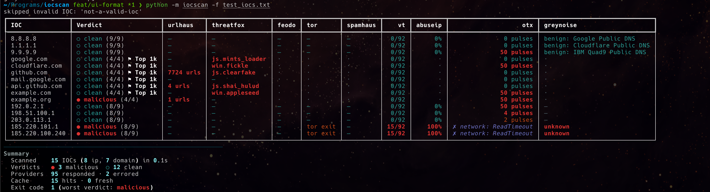

# iocscan


[](https://www.python.org/downloads/)
[](LICENSE)

Blue-team CLI that produces a consolidated `malicious / suspicious / clean / unknown` verdict for IP addresses, domains, URLs and file hashes by querying multiple open-source threat-intelligence providers in parallel.

Many providers work out of the box (no API key). The rest activate when you add free-tier API keys.

---

## Install

Requires Python 3.11 or newer.

**Linux / macOS:**

```bash
git clone https://github.com/erhanersoyy/iocscan.git
cd iocscan
python3 -m venv .venv
source .venv/bin/activate
pip install -r requirements.txt
```

**Windows (PowerShell):**

```powershell
git clone https://github.com/erhanersoyy/iocscan.git
cd iocscan
python -m venv .venv
.venv\Scripts\Activate.ps1
pip install -r requirements.txt
```

> On Windows, POSIX file permissions (`0600`) cannot be enforced on `config.toml`. The file is still protected by NTFS ACLs on your user account, but on multi-user machines treat this as weaker than the Unix guarantee. iocscan prints a one-line warning when this applies.

That's it. Every command below assumes the venv is active. Re-activate any new terminal with `source .venv/bin/activate` (or `.venv\Scripts\Activate.ps1` on Windows).

---

## Quick start

```bash
python -m iocscan 1.2.3.4 evil.com           # scan one or more IOCs
python -m iocscan -f iocs.txt                # one IOC per line, # comments allowed
cat iocs.txt | python -m iocscan             # pipe from stdin
python -m iocscan --json 8.8.8.8 > out.json  # machine-readable
python -m iocscan --quiet -f iocs.txt        # one TSV line per IOC
python -m iocscan --defang evil.com          # render output as evil[.]com
python -m iocscan --sort verdict -f iocs.txt # worst-first
python -m iocscan providers                  # see which providers are active
```

iocscan understands common defanged formats (`evil[.]com`, `1[.]2[.]3[.]4`, `hxxp://...`) and bare URLs (the hostname is extracted).

> Tip: if `python -m iocscan ...` feels verbose, add an alias to your shell rc:
> `alias iocscan='python -m iocscan'` — then everything below works as `iocscan ...`.

---

## Aliases

A set of alias suggestions is provided to make IOC analysis faster and simpler. Drop them into your shell rc file — `~/.zshrc`, `~/.bashrc`, `~/.config/fish/config.fish`, or whichever shell you use. After reloading (`source ~/.zshrc`), every common triage flow becomes a one-line command.

```bash
# 1) Base alias — replaces "python -m iocscan" with a short word
alias ioc='python -m iocscan'                                # ioc 1.2.3.4

# 2) Quick verdict — minimum noise: "ioc<TAB>verdict<TAB>n/m"
alias ioc-q='python -m iocscan --quiet'                      # ioc-q 1.2.3.4

# 3) Full evidence — every provider's cell, force wide table
alias ioc-full='python -m iocscan --wide'                    # ioc-full evil.com

# 4) Defanged output — safe to paste into tickets, chat, email
alias ioc-safe='python -m iocscan --defang'                  # ioc-safe 1.2.3.4

# 5) Explain mode — per-provider rationale and verdict math
alias ioc-why='python -m iocscan explain'                    # ioc-why 1.2.3.4

# 6) JSON output — pipe into jq, SIEM, Slack bot, anything
alias ioc-json='python -m iocscan --format json'             # ioc-json evil.com | jq .

# 7) Hyperlinked cells — terminal underlines clickable provider links
alias ioc-link='python -m iocscan --cell-links --wide'       # ioc-link 1.2.3.4

# 8) Fresh look — bypass cache, useful right after a blocklist update
alias ioc-fresh='python -m iocscan --no-cache --wide'        # ioc-fresh 1.2.3.4

# 9) Splunk hunt query — emit SPL search string for SOC pivots
alias ioc-splunk='python -m iocscan -F splunk-spl'           # ioc-splunk 1.2.3.4

# 10) Microsoft Sentinel KQL hunt query
alias ioc-sentinel='python -m iocscan -F kql-sentinel'       # ioc-sentinel evil.com

# 11) Microsoft Defender KQL hunt query
alias ioc-defender='python -m iocscan -F kql-defender'       # ioc-defender 1.2.3.4

# 12) CSV export — ticket attachments, spreadsheet imports
alias ioc-csv='python -m iocscan -F csv'                     # ioc-csv -f iocs.txt > out.csv

# 13) Markdown table — paste straight into PR / Confluence / ticket
alias ioc-md='python -m iocscan -F markdown'                 # ioc-md 1.2.3.4

# 14) Worst-first sort — surface malicious IOCs at the top of bulk scans
alias ioc-sort='python -m iocscan --sort verdict'            # ioc-sort -f iocs.txt

# 15) Provider status — see what's active vs. missing-key at a glance
alias ioc-prov='python -m iocscan providers'                 # ioc-prov
```

Pick the two or three you actually use. The point is: one IOC → one short command.

---

## Flags

| Flag | Description |
|---|---|
| `-f`, `--file <path>` | Read IOCs from a file (one per line, blank lines and `#` comments are ignored). |
| `-F`, `--format <fmt>` | Output format: `table` (default), `json`, `jsonl`, `csv`, `markdown`, or a hunt-query format (`splunk-spl`, `kql-sentinel`, `kql-defender`, `crowdstrike-fql`, `elastic-eql`, `elastic-lucene`, `suricata-ip-rules`). |
| `--json` | Deprecated alias for `--format json`. |
| `--no-cache` | Bypass the SQLite cache for this run and re-query every provider live. |
| `--debug` | Verbose stderr logging (HTTP traffic, provider errors) without leaking API keys. |
| `--narrow` | Force the compact table layout, even on wide terminals. |
| `--wide` | Force the wide table layout, even when the terminal is narrower than 100 columns. |
| `--ascii` | Use ASCII glyphs (`[!]`, `[~]`, `[ ]`) instead of Unicode for compatibility with old terminals. |
| `--theme <name>` | Pick a color theme: `solarized-dark` (default), `forensic`, `mocha`, `latte`. Env: `IOCSCAN_THEME`. |
| `--list-themes` | Render a one-line preview of every available theme, then exit. |
| `--defang` | Render IOCs in defanged form (`1.2.3[.]4`, `evil[.]com`) so output is safe to paste anywhere. |
| `--cell-links` | Emit OSC 8 hyperlinks on provider cells so modern terminals make them clickable. |
| `-q`, `--quiet` | Suppress table and footer; emit one TSV line per IOC (`IOC\tverdict\tcoverage`) for scripting. |
| `--links-only` | Emit `IOC\tprovider\tpermalink` TSV (only rows where a permalink exists); suppresses normal output. |
| `--sort <key>` | Output order: `input` (default), `verdict` (worst-first), `coverage` (most-evidence-first). |
| `--include <paths>` | JSON only: comma-separated dot-paths to keep (e.g. `results.*.ioc,results.*.verdict`). |
| `--exclude <paths>` | JSON only: comma-separated dot-paths to drop (applied after `--include`). |
| `--<provider>-key <key>` | Pass a provider key on the CLI (`--vt-key`, `--abuseipdb-key`, `--otx-key`, `--greynoise-key`, `--abusech-key`, `--urlscan-key`). Insecure — visible via `ps`; prefer env vars or `config set`. |

---

## Reading the output

Example scan of a mixed batch of IPs and domains (default `solarized-dark` theme, wide table):



iocscan renders a **wide** table when the terminal is at least 100 columns and a **compact** table when it isn't. Use `--narrow` to force compact or `--wide` to force wide. Pass `--ascii` to swap Unicode glyphs for `[!]`/`[~]`/`[ ]`/etc. fallbacks. The standard `NO_COLOR` and `FORCE_COLOR` env vars are honored to disable or force ANSI colors.

### Themes

Four built-in color themes, each WCAG-AA contrast-verified:

| Theme | Best for |
|---|---|
| `solarized-dark` (default) | Solarized terminals, dark backgrounds |
| `forensic` | High-contrast "operations room" feel, projection-ready |
| `mocha` | Catppuccin Mocha, modern dark terminals |
| `latte` | Catppuccin Latte, light terminals |

Pick one with `--theme <name>` or set the `IOCSCAN_THEME` env var. Preview every theme with:

```bash
python -m iocscan --list-themes
```

### Cell semantics

Each provider column reports one cell per IOC. The cell tells you what the provider saw, not what the final verdict is — coverage and weighting are applied later by the aggregator.

| Cell | Meaning |
|---|---|
| `— (no hit - clean)` | Provider ran successfully and found nothing on this IOC. Counts as a clean vote toward the verdict. |
| `?` | Provider responded but the result is inconclusive (ambiguous score, insufficient data). Does not count toward coverage. |
| `·` | Provider does not apply to this IOC type (e.g. an IP-only feed against a domain). Excluded from coverage. |
| `0/92`, `50 pulses`, `tor exit`, `15%` | Numeric or labelled score returned by the provider. Interpretation is provider-specific. |
| `✗ <msg>` | Hard failure: network error, 5xx response, or a parse error. Does not count toward coverage. |
| `▲ 429 rate limit` | Provider rate-limited the request. Retryable; does not count toward coverage. |
| `⚡ auth failed` | The API key is missing, wrong, or expired. Fix with `config set` or the matching env var. |

A `— (no hit - clean)` cell is the only "clean" signal a provider can emit — there is no green check. Errors and rate limits are deliberately separated from "unknown" so coverage reflects only what providers actually answered.

### Output modes

| Flag | Format | Use case |
|---|---|---|
| *(default)* | Colored table + summary footer | Interactive triage |
| `--format json` | Pretty JSON to stdout | SOAR / SIEM ingestion (full provider detail) |
| `--format jsonl` | One JSON object per line | Streaming pipelines |
| `--format csv` | RFC 4180 CSV with 6 columns | Spreadsheets / ticket attachments |
| `--format markdown` | GitHub-flavored markdown table | Paste into PR / Confluence / ticket |
| `--quiet` / `-q` | TSV: `IOC\tverdict\tcoverage` per line | `grep` / `awk` / CI scripts |
| `--defang` | Renders IOCs as `evil[.]com`, `1[.]2[.]3[.]4` in any of the above | Pasting into Slack / email / Confluence without auto-links |

`--json` still works as a deprecated alias for `--format json`. `--quiet` wins over `--format` (low-noise contract).

JSON is the only format that carries the full per-provider breakdown — `jsonl`, `csv`, and `markdown` are flat summary exports (IOC, type, verdict, coverage, whitelisted).

---

## Providers

iocscan ships with 17 providers. **Verdict** providers contribute a vote to the final verdict; **enrichment** providers add context (ASN, certificates, ports, whois age) without influencing the score.

| Provider | Role | Key | IOC types | Official site |
|---|---|---|---|---|
| URLhaus | Verdict | Auth-Key (free) | IP, domain, URL | <https://urlhaus.abuse.ch> |
| ThreatFox | Verdict | Auth-Key (free) | IP, domain, URL, hash | <https://threatfox.abuse.ch> |
| MalwareBazaar | Verdict | Auth-Key (free) | hash | <https://bazaar.abuse.ch> |
| YARAify | Verdict | Auth-Key (free) | hash | <https://yaraify.abuse.ch> |
| CIRCL Hashlookup | Verdict | none | hash | <https://hashlookup.circl.lu> |
| Feodo Tracker | Verdict (authoritative) | none | IP | <https://feodotracker.abuse.ch> |
| Spamhaus DROP | Verdict (authoritative) | none | IP | <https://www.spamhaus.org/drop/> |
| Tor Exit List | Verdict | none | IP | <https://check.torproject.org/exit-addresses> |
| VirusTotal | Verdict (weight ×2) | free 500/day | IP, domain, URL, hash | <https://www.virustotal.com> |
| AbuseIPDB | Verdict | free 1000/day | IP | <https://www.abuseipdb.com> |
| AlienVault OTX | Verdict (weight ×2) | free | IP, domain, URL, hash | <https://otx.alienvault.com> |
| GreyNoise Community | Verdict | optional (raises rate limit) | IP | <https://www.greynoise.io> |
| urlscan.io | Verdict | optional | URL | <https://urlscan.io> |
| Shodan InternetDB | Enrichment | none | IP | <https://internetdb.shodan.io> |
| Team Cymru ASN | Enrichment | none | IP | <https://team-cymru.com/community-services/ip-asn-mapping/> |
| WHOIS Age | Enrichment | none | IP, domain | <https://www.iana.org/whois> |
| crt.sh | Enrichment | none | domain | <https://crt.sh> |

> abuse.ch endpoints (URLhaus, ThreatFox, MalwareBazaar, YARAify) require an Auth-Key on their query APIs. Registration is free at <https://auth.abuse.ch> — the same single key covers all four.

> "Authoritative" means a single `malicious` hit from that provider is enough to mark the IOC `malicious` regardless of what the others say. See [Verdict logic](#verdict-logic-in-short).

---

## Configure API keys

Three ways to provide keys (lowest → highest priority): config file → environment variable → CLI flag. Higher priority overrides lower.

**Recommended — config file** (stored at `~/.iocscan/config.toml`, mode 0600):

```bash
python -m iocscan config set abusech    YOUR_KEY  # single key for all abuse.ch endpoints
python -m iocscan config set virustotal YOUR_KEY
python -m iocscan config set abuseipdb  YOUR_KEY
python -m iocscan config set otx        YOUR_KEY
python -m iocscan config set greynoise  YOUR_KEY  # optional; raises anonymous rate limit
python -m iocscan config set urlscan    YOUR_KEY  # optional
```

**Environment variables** (useful in CI):

```bash
export IOCSCAN_ABUSECH_KEY=...
export IOCSCAN_VT_KEY=...
export IOCSCAN_ABUSEIPDB_KEY=...
export IOCSCAN_OTX_KEY=...
export IOCSCAN_GREYNOISE_KEY=...   # optional
export IOCSCAN_URLSCAN_KEY=...     # optional
```

**CLI flags** (insecure — visible to other local users via `ps`; prefer env or config):

```bash
python -m iocscan --vt-key YOUR_KEY 8.8.8.8
```

Inspect what's loaded (keys are masked):

```bash
python -m iocscan config show
python -m iocscan config path
```

---

## Usage scenarios

### 1. SOC analyst — quick triage

```bash
python -m iocscan 185.220.101.1 malicious-domain.test
```

Output is a colored table with one row per provider plus a final verdict, plus per-IOC coverage (e.g. `7/9 responding`).

### 2. Bulk scan from a file

```bash
# iocs.txt
# Indicators from incident #4231
185.220.101.1
evil[.]com
hxxps://phish.example/login

python -m iocscan -f iocs.txt
```

Blank lines and `#` comments are ignored. Defanged formats are normalised automatically.

### 3. SOAR / SIEM integration with `--json`

```bash
python -m iocscan --json -f iocs.txt > results.json
```

```jsonc
{
  "results": [
    {
      "ioc": "8.8.8.8",
      "type": "ip",
      "verdict": "clean",
      "responding": 6,
      "total": 7,
      "whitelisted": false,
      "providers": [
        { "provider": "virustotal", "verdict": "clean", "score": "0/94", "latency_ms": 312 },
        { "provider": "abuseipdb",  "verdict": "clean", "score": "0%",   "latency_ms": 188 }
        // ...
      ]
    }
  ]
}
```

### 4. CI / CD pipeline — fail the build on malicious IOCs

```bash
python -m iocscan -f deploy-artifacts/ioc-extract.txt
case $? in
  0) echo "all clean — proceed";;
  1) echo "MALICIOUS IOC found — block release"; exit 1;;
  2) echo "suspicious IOC — manual review";;
  4) echo "all providers failed — retry later";;
  5) echo "too little coverage — add API keys";;
esac
```

### 5. Threat hunting — stream from logs

```bash
grep -oE '([0-9]{1,3}\.){3}[0-9]{1,3}' /var/log/access.log \
  | sort -u \
  | python -m iocscan --json \
  | jq '.results[] | select(.verdict == "malicious") | .ioc'
```

### 6. Phishing email triage

Paste defanged indicators from a report straight in:

```bash
echo "login-secure[.]bank-update[.]top" | python -m iocscan
```

---

## Verdict logic (in short)

1. If fewer than `min_coverage` providers (default 3) respond non-error/non-unknown → `unknown`.
2. If any **authoritative** provider (Spamhaus DROP, Feodo Tracker) returns `malicious` → final `malicious`.
3. Otherwise weighted vote at ≥30%: VirusTotal and OTX count as 2; others count as 1.
4. Whitelist override: if the IOC is a bundled-whitelist or Tranco top-1K domain, `malicious`/`suspicious` is clamped to `clean` (and the table marks it as whitelisted).

---

## Cache

Results are cached at `~/.iocscan/cache.db` for 24 hours.

```bash
python -m iocscan --no-cache 8.8.8.8        # bypass cache for one run
python -m iocscan cache stats               # rows, IOCs, age, disk size
python -m iocscan cache clear               # flush everything
```

The cache merges with new fetches per-provider — missing providers (e.g. newly-added API key) are filled in incrementally.

---

## Whitelist (optional Tranco top-1K)

`iocscan` ships with a bundled list of well-known infrastructure domains that always override `malicious`/`suspicious` to `clean`. To augment with the [Tranco](https://tranco-list.eu) top-1K daily list (research-grade popularity ranking):

```bash
python -m iocscan whitelist update   # fetch latest Tranco top-1K (~50 KB)
python -m iocscan whitelist stats    # cache age, domain count
```

The cache lives at `~/.iocscan/tranco-1k.txt`. Re-run `update` weekly to keep it fresh.

---

## Uninstall

iocscan does not install anything system-wide. Removing the project comes down to deleting the three things it creates. A guided script is included for each platform:

```bash
./uninstall/uninstall.sh           # Linux / macOS
```

```powershell
.\uninstall\uninstall.ps1          # Windows (PowerShell)
```

The script walks through four steps, asking for confirmation before each:

| Step | What it removes |
|---|---|
| 1 | `~/.iocscan/` — API keys (`config.toml`), TI cache (`cache.db`), Tranco whitelist (`tranco-1k.txt`). Offers to back up `config.toml` first. |
| 2 | `<project>/.venv/` — the project-only virtualenv (httpx, rich, pytest, …). Other projects' venvs are unaffected. |
| 3 | The project directory itself — source, tests, local git history. Uncommitted changes are lost. |
| 4 | **Manual only**: GitHub remote repo deletion (irreversible, never automated). |

**Not touched** (anything that belongs to other projects or the system): `python3`, `git`, `gh`, `pip`, Homebrew, `~/.ssh/`, `~/.gitconfig`, or other `.venv` directories on the machine.

If you'd rather do it by hand:

```bash
rm -rf ~/.iocscan/         # user data (consider backing up config.toml first)
rm -rf .venv/              # project venv
cd .. && rm -rf iocscan/   # project source + local git history
```

---

## License

MIT — see [LICENSE](LICENSE).
